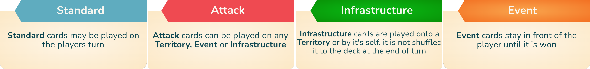
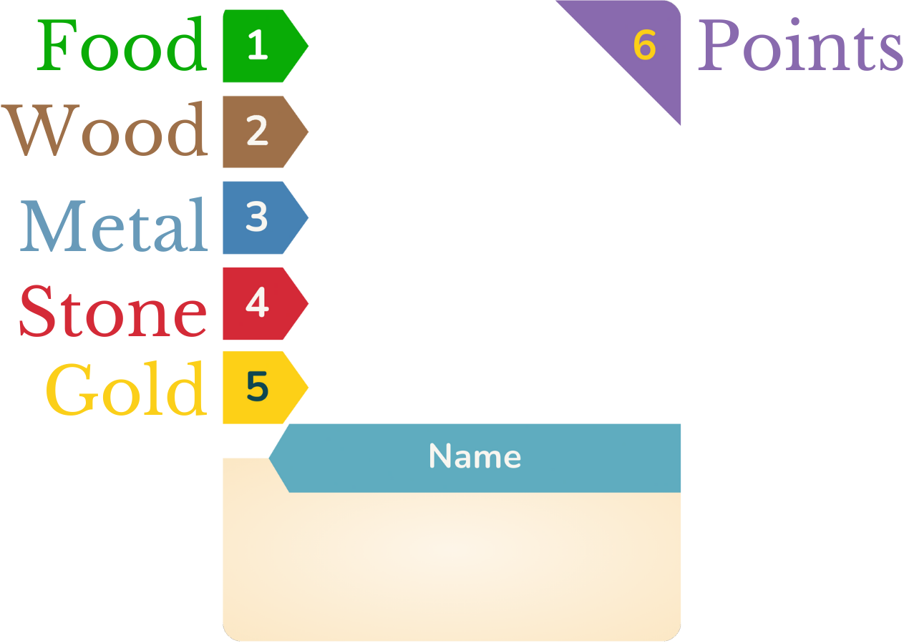
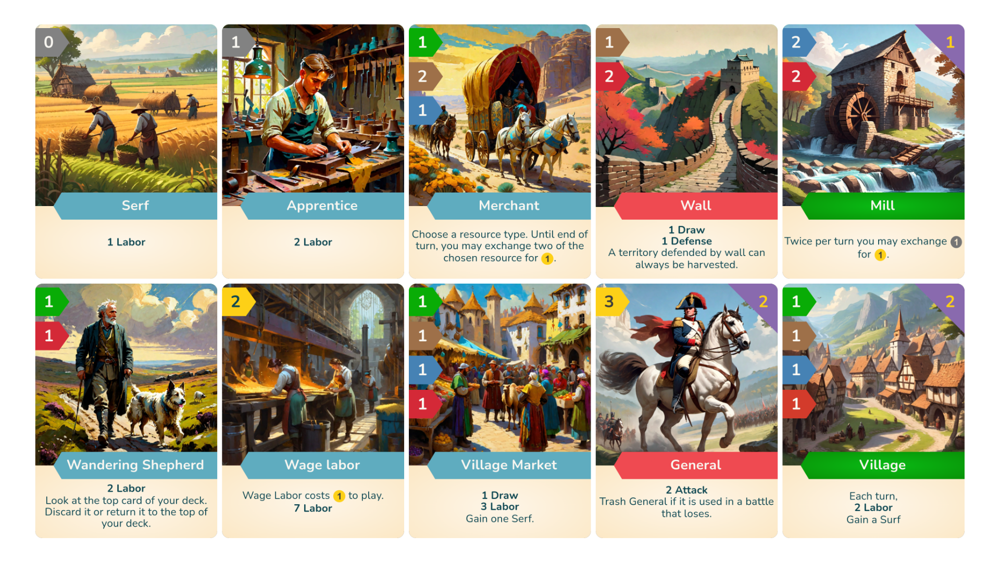

   
   *This game is still in alpha and actively being playtested*
  
  # `Coin and Conquest`
  
#### Tabletop deck building game that emphasizes player interaction 

[About](#about) •
[How to play](#how-to-play) •
[Print & Play](#print--play) •
[Credits](#credits) •
[Contact Us](#contact-us)

 

## About

Coin and Conquest is a brutal deck building card game that pairs 3-5 players against each other as medieval lords. It’s a cutthroat struggle to the top, so mind who you play with as feelings can get hurt. The game’s asymmetrical start does not lend itself to power gamers. For best results, the game should be approached with a light-hearted mercilessness. This is made easier by the fact that you can always say the odds were never stacked in your favor, and that game dynamics can change drastically with only one round of combat, well-timed card draw, or a deal (read: blackmailed agreement) between players.
### Inspiration
We were inspired by games such as [Dominion](https://www.riograndegames.com/games/dominion), [Loot](https://gamewright.com/product/Loot), [Magic The Gathering](https://magic.wizards.com/), [Catan](https://www.catan.com/) and others tabletop games. While Dominion was a pioneer of the deckbuilding genre, it lacks in player interaction. This led us to explore making a game that combined deckbuilding, negotiation, resource management, and territorial control. 

### Our Goals
* High player interaction
* Diverse deckbuilding opportunities
* 3 - 5 players
* Actually under 1.5 hours to play (many games highly underestimate their duration)
* Small box

### Results
The current game is still in Alpha testing so this is currently not a finished game but the results of our playtest have been promising.

(<a href="#readme-top">back to top</a>)

## How to play
### Goal
Your goal when playing Coin and Conquest is to make the most of the territory(s) you control and build your kingdoms economy i.e your deck. The winner is the player with the most victory points at the end of the game. Each territory a player controls is worth 4 points and certain other cards also have their point value in the top right corner.

### Territories
In C&C each player starts with 2 Territories and a deck of 10 cards. This is their inheritance, this is the foundation of their kingdom. but each kingdom does not have the same geography and therefore not the same access to resources. In C&C there are 4 territory types.

   
    
    
          

The land that you control will dictate much of what you can do with your kingdom. But if you feel constrained by the limits of your land don't worry you can always take someone else's. But to fight a war your going to need

### Resources 
Resources are vital to your Kingdom and are used to buy Cards and pay for activated abilities.\
There are 5 resource types Food, Wood, Steel, Stone, and Gold. 4 of which can be extracted with labor from its corresponding territory.

- Field  = Food
- Forest = Wood
- Mine   = Steel
- Quarry = Stone

Gold the 5th resources can be made in a variety of way, The most basic of which is trading 4 of any resources with the Bank for one Gold.
Resources can be used to buy Cards and pay for activated abilities.

### Card Types

<!--
### Card brackdown
 

### Resources

-->

### Example Cards

<!--

-->

   
  
  
  

  
  
  
  

(<a href="#readme-top">back to top</a>)

## Print & Play

#### [rules.pdf](https://raw.githubusercontent.com/AndersonBrothers/4-Kings/New-README.md/media/pdf/rules.pdf)  
#### [cards.pdf](https://raw.githubusercontent.com/AndersonBrothers/4-Kings/New-README.md/media/pdf/cards.pdf)  
#### [tokens.pdf](https://raw.githubusercontent.com/AndersonBrothers/4-Kings/New-README.md/media/pdf/tokens.pdf)

(<a href="#readme-top">back to top</a>)

## Credits

### Playtesters
- Noel Anderson
- Silas Anderson
- Ranulph Brown
- Owa Hughes
- Toby Hughes
- Elijah Jackson
- Nick Kapitulik
- Caleb Kennedy
- Kate Likhite
- Max Shapiro
- Jayden Skelly
- Willie Thacker

### Programmes Used

[Dextous](https://www.dextrous.com.au/)  
[Gimp](https://www.gimp.org/)

(<a href="#readme-top">back to top</a>)

## Contact Us
`Anderson.Brothers@protonmail.com`
