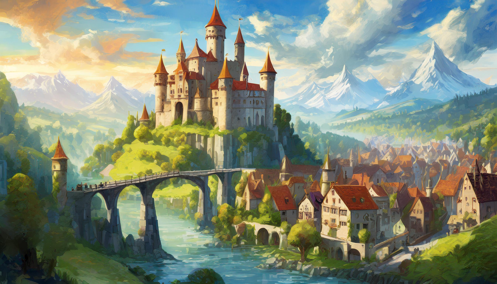
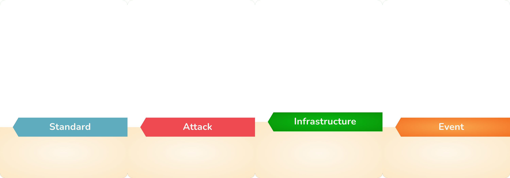

  
  # `4 Kings`
  
Tabletop deck building game that emphasizes player interaction

[About](#about) •
[How to play](#how-to-play) •
[Print & Play](#print--play) •
[Credits](#credits)

 

## About

Four Kings is a brutal deck building card game that pairs 4-5 players against each other as medieval lords. It’s a cutthroat struggle to the top so mind who you play with, feelings can get hurt. The games asymmetrical start does not lend itself to power gamers. For the best results the game should be approached with a light-hearted seriousness. This is made easier by the fact you can always say the odds were stacked against you.
We were inspired by games such as [Dominion](https://www.riograndegames.com/games/dominion), [Loot](https://gamewright.com/product/Loot), [Magic The Gathering](https://magic.wizards.com/), [Catan](https://www.catan.com/) and others tabletop games. While Dominion was a pioner of the deckbuilding genre it lacks in player interaction. 

### Goals
* High player interaction
* Diverse deckbuilding opportunities
* 4 - 5 players
* Under 2 real hours to play
* Small box

(<a href="#readme-top">back to top</a>)

## How to play

### Card Types

<!--
### Card brackdown
 

### Resources

-->

There are 4 basic resource types. each resource can be extracted from its corresponding territory with labor. 

- Field  = Food
- Forest = Wood
- Mine   = Steel
- Quarry = Stone

### Example Cards

<!--

-->

   
  
  
  

  
  
  
  

(<a href="#readme-top">back to top</a>)

## Print & Play

[rules.pdf](https://raw.githubusercontent.com/AndersonBrothers/4-Kings/New-README.md/media/pdf/rules.pdf)  
[cards.pdf](https://raw.githubusercontent.com/AndersonBrothers/4-Kings/New-README.md/media/pdf/cards.pdf)  
[tokens.pdf](https://raw.githubusercontent.com/AndersonBrothers/4-Kings/New-README.md/media/pdf/tokens.pdf)

(<a href="#readme-top">back to top</a>)

## Credits

### Playtesters
- Noel Anderson
- Silas Anderson
- Ranulph Brown
- Owa Hughes
- Toby Hughes
- Elijah Jackson
- Nick Kapitulik
- Caleb Kennedy
- Kate Likhite
- Max Shapiro
- Jayden Skelly
- Willie Thacker

### Programmes Used

[Dextous](https://www.dextrous.com.au/)  
[Gimp](https://www.gimp.org/)

(<a href="#readme-top">back to top</a>)

